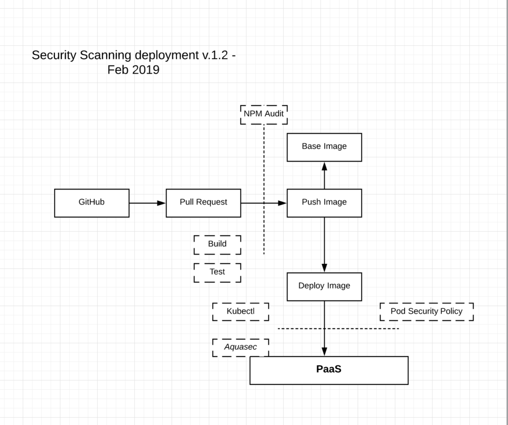

Kubernetes-Cluster-Security
==================
Benchmarking cluster security and how to improve it.

KubeSec
-----------
We use KubeSec to scan kubernetes resource and score them against known
issues

KubeHunter
----------
Run an active or passive scanning of vulnerabilities on your cluster

MicroScanner
---------------
* CICD Scanner for container images

Clair
-------
* Container image scanning in the registry

Architecture
-------------

Policies
----------
* Policies are important for governance on top of kubernetes.
* [Advanced AdmController Guide](https://engineering.opsgenie.com/advanced-kubernetes-objects-53f5e9bc0c28)
* [PodSecurityPolicies](https://github.com/freach/kubernetes-security-best-practice/tree/master/PSP)

CIS Kubernetes 1.4 Security Benchmark
-----------------------------------
* Kube Bench allows you to do the scanning of your cluster against the CIS benchmarks
* Here is the [Security Benchmark](./benchmark.pdf)
* https://www.cisecurity.org/benchmark/kubernetes/

Resources
-----------
* https://medium.com/faun/security-problems-of-kops-default-deployments-2819c157bc90
* https://medium.com/faun/auditing-continuously-vs-monitoring-continuously-749e7c248d92

Something more like this?
---------------------------
* https://github.com/freach/kubernetes-security-best-practice
